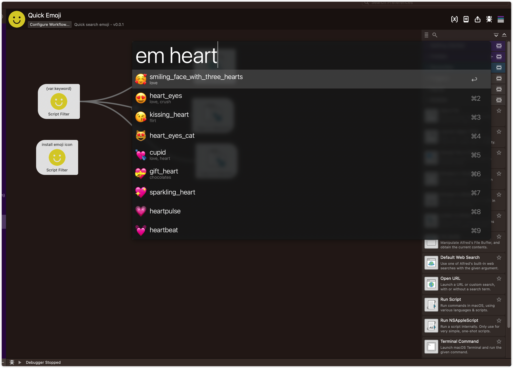

# Alfred Quick Emoji Workflow

This project uses [gemoji](https://github.com/github/gemoji/blob/master/db/emoji.json) as the emoji database, which provides the following functions:

- Emoji fuzzy search
- Emoji input
- Emoji page jump

## Installation

1. Go to [Releases](https://github.com/HanleyLee/alfred-quick-emoji-workflow/releases) page to download the latest release file named
   *Quick Emoji.alfredworkflow*.
2. Double click `Quick Emoji.alfredworkflow` in your local folder to install.
3. Finish!

## Usage

Use em as a keyword to search, and after searching the corresponding results, you can use `↩` / `⌘` / `⌥` to jump, copy, and paste.

## Development

Use `make install` to install dependencies.

## Ref

- [gemoji](https://github.com/github/gemoji)
- [alfred-emoji-mate](https://github.com/fedecalendino/alfred-emoji-mate)

## License

All codes in this warehouse are distributed and used based on [Apache License 2.0](http://www.apache.org/licenses/LICENSE-2.0). For the full text of
the agreement, see [LICENSE](https://github.com/hanleylee/alfred-quick-emoji-workflow/blob/main/LICENSE) file.

Copyright 2021 HanleyLee

---

Welcome, if you have any bugs, I hope to raise issues. If it is useful to you, please mark a star ⭐️